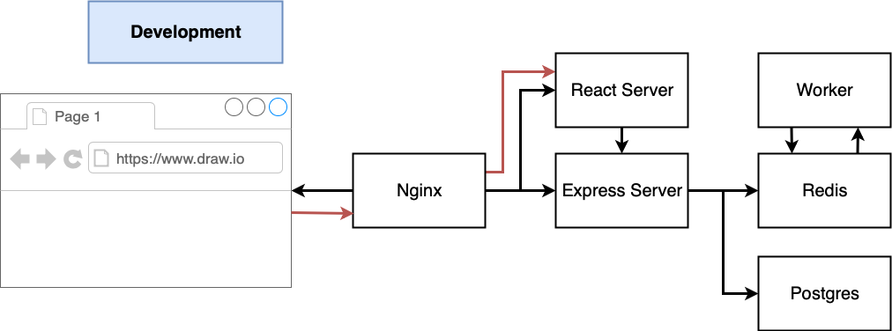
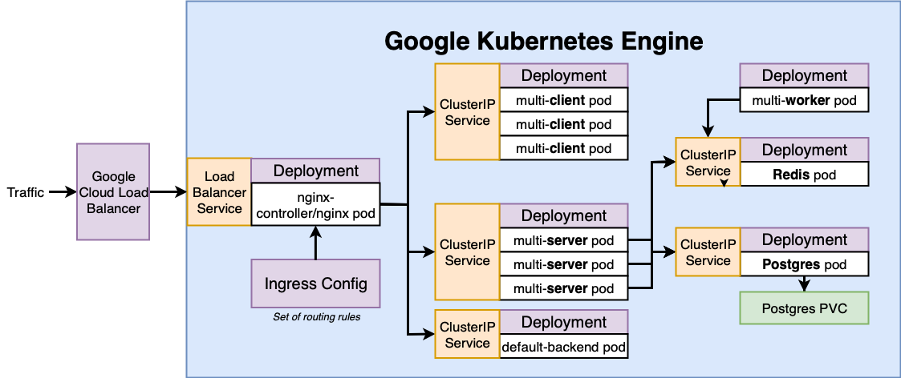
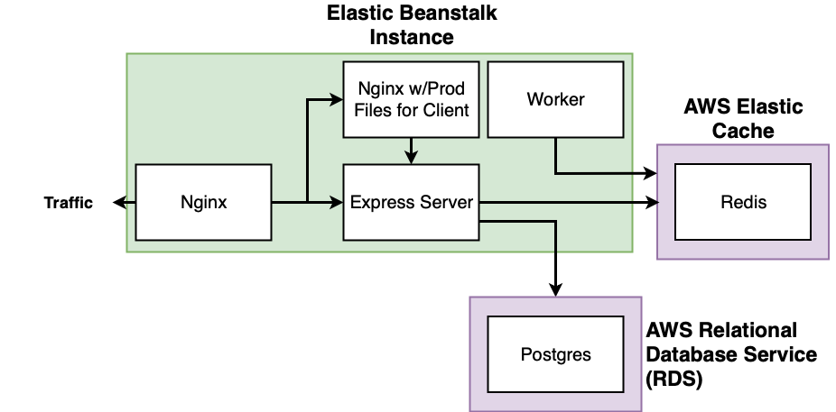
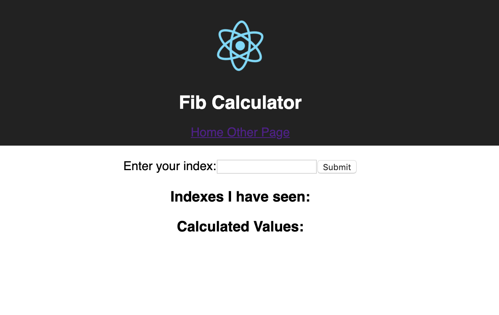

# Multi Containers Application Deployment

In this project, we will deploy overcomplicated Fibonacci Calculator using docker-compose, Google Kuberentes Engine and AWS Elastic Beanstalk. Deployment process have been automated via Travis CI, which will deploy when commit is done on master.

**Please Note:-** This repo doesn't contain steps required for Google Kubernetes Engine setup or AWS Beanstalk setup or Travis CI environment variables setup etc. You can refer to this amazing [Udemy Course](https://www.udemy.com/course/docker-and-kubernetes-the-complete-guide/learn/lecture/16242264#announcements).

## Application Components 
- **Server** - A node application which connect with postgres database and redis. It have APIs for showing result from postgres DB and redis cache. 
- **Worker** - A node application which constantly monitor redis for new input submitted by user and calculate Fibonacci number.
- **Client** - A react app which render a UI with previously calculated results and allow to submit a new request. Client is hosted using nginx after building react app.
- **nginx** - Used for creating http routing for Server and Client. This will be only used during docker-compose based local deployment or AWS Elastic Beanstalk Deployment. For kubernetes, we will use ingress-nginx service instead.
- **postgres** - A DB server for storing number submitted by users for calculating Fibonacci numbers. We will use AWS Relational Database service (RDS) postgres for Beanstalk.
- **redis** - Used for caching recently submitted numbers and corresponding calculated Fibonacci numbers. 

## Docker Compose Dev Setup
- We have different dockerfiles for development and production.
- **docker-compose.yml** included in this repo should only used for development purpose as Dockerfile.dev are used.
- Running development setup
    >> docker-compose up 

## Google Kubernetes Engine Deployment 
- Check **master** / **k8s-deployment** Branch for all configurations. 
- All kubernetes releated config files can be found in **k8s** folder.
-  **.travis.yml** will setup google cloud SDK, run tests, create production images, push to DockerHub and finally run **deploy.sh** script for updating cluster.

## AWS Elastic Beanstalk Deployment
- Check **elastic_beanstalk** branch for all details including **Dockerrun.aws.json** and **.travis.yml** 

## Notes
- Travis CI will do sanity testing and create production Docker images and push images to DockerHub.
- Travis CI will send trigger to Elastic Beanstalk or run script for Google Kubernetes cluster for updating application in deploy stage.
- For redis, we can use AWS Elasti Cache (EC), but we haven't used as it is not included in AWS free tier.

## Deployed App Screenshot

